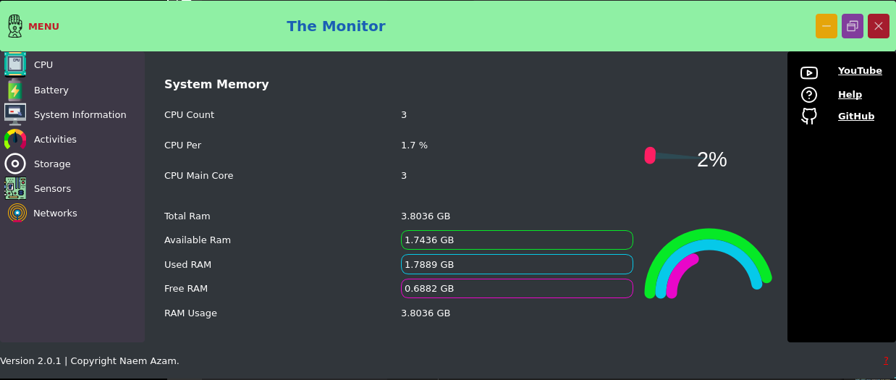

# The Monitor

The Monitor-System Monitor, as the name suggests, is a clean and simple system monitoring app for your Windows Or Linux . It graphically shows usages of various system components. View list of active apps and processes and their CPU usage, RAM usage, network activity, PID and UID.

<a href="https://youtu.be/t90yWd8ADbs">   </img> </a>

## Features

- System Information. 
- Power and battery Uses
- The Details About Your Process Activities, You can Kill, Resume or Start any process By one click. You can monitor Your Background Process and Services. 

-  All Disk information, In the future We will add Data recovery To it. 
-  monitor and Manage Of Of Your Sensors and External devices
- The last and most powerful thinggis that You can Monitor Your Network System fully. You can watch network devices Their data Uses. You will Know the current mac address, IP address, Network Adapter, And all kinds of Protocols, and many more...

<a href="#">  </img> </a>  <a href="#">  </img> </a>

## Badges

 
## 🚀 About Creator

# Hi, I'm Naem Azam! 👋

Hi, i'm Naem Azam, a passionate self-taught Python Progammer. my passion for System lies with dreaming up ideas and making them come true with elegant interfaces. i take great care in the experience, architecture, and code quality of the things I build.

## Author

- [@naemazam](https://www.github.com/naemazam)

  
## 🛠 Skills
Python, Pyqt5, HTML, CSS...

  
